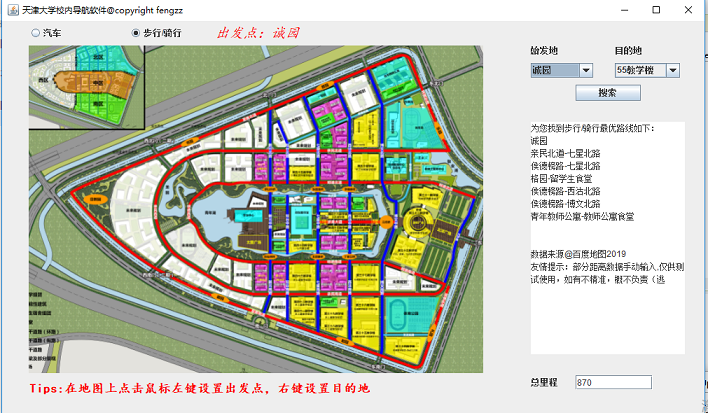

# Tianjin_University_campus_GPS
&emsp;基于Jfram使用dijstra算法实现的天大新校区导航软件

## Basic function
+ 用户给出校内建筑和道路作为出发点和目的地，软件可以给出两点间机动车和自行车的最短路线（包括路线和距离）。
+ 支持用户在地图上相应点击确定出发点和目的地。
+ 支持校内点101个
## Implementation
